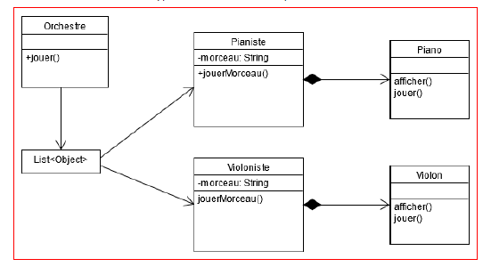
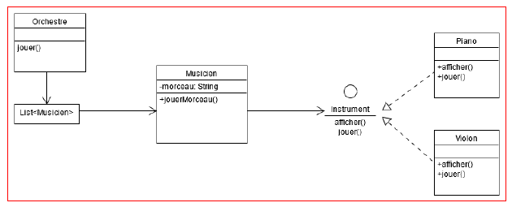

# Couplage fort
Pour illustrer la notion de couplage fort, prenons l’exemple d’un orchestre.

- Un orchestre fera référence à une liste de musiciens. 
- Nous vous fournissons 2 types de musiciens les pianistes et les violonistes.
- L'objectif pour vous est d'ajouter un 3e type de musicien : les batteurs.

Il y a plusieurs couplages forts dans ce diagramme :

- La classe _**Pianiste**_ dépend fortement de son association avec **_Piano_**.
- Si il y avait une modification de la classe **_Piano_**, par exemple la modification du nom
  de la méthode jouer, la méthode _**jouerMorceau()**_ de **_Pianiste_** ne fonctionnerait plus.
- On dit que les 2 classes sont liées fortement.

Le problème est identique avec le **_Violoniste_** fortement dépendant de son **_Violon_**. Un
changement de la classe **_Violon_** ou sa suppression auront un impact sur la classe **_Violoniste_**.
De plus un **_Violoniste_** ne peut ici jouer que de l’implémentation de **_Violon_** proposée, alors
qu’il existe une grande variété de violons différents.

Enfin, la classe **_Orchestre_** utilise aussi un couplage fort pour définir les membres de l’orchestre.

En effet, cette classe fait appel directement aux classes **_Pianiste_** et **_Violoniste_**. Le
couplage fort empêche d’ajouter d’autres types de musiciens facilement, il faudra
modifier la classe **_Orchestre_** pour le faire.

# Couplage faible

Ajout d’une interface **_Instrument_**, elle permet de référencer les comportements possibles sur
les instruments de musique.

Les 2 classes **_Piano_** et **_Violon_** doivent implémenter cette interface.

Elles sont maintenant cachées par cette interface, et si l’application évolue et qu’il
faut ajouter la classe **_Batterie_**, **_Trompette_** (etc), l’architecture vers **_Musicien_** ne change pas il y aura
seulement un nouveau type d’Instrument